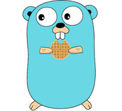

<h1 align="center">GOFre - A Sweet Web Framework for Go</h1>

<p align="center">

</p>

_GOFree[^1]_ is a web framework for Go, without third-party dependencies, that makes the development of web applications a joy.  _GOFre_ integrates with `http.Server` and supports the standard Go HTTP handlers: `http.Handler` and `http.HandlerFunc`.

This framework was developed around simplicity of usage and extensibility and offers the following features:
* **Path pattern matching** - including regex, path variable extraction and validation
* **Middleware** - pre and post request interceptors
* **Templating** - including static resources
* **Authentication** - OAUTH2 flow included for GitHub and Google
* **Authorization** - RBAC implementation
* **SSE (Server Sent-Events)**
* **Security** - CSRF Middleware protection

## Installation

You can install this repo with `go get`:
```sh
go get github.com/ixtendio/gofre
```

## Usage

```go
gofreMux, err := gofre.NewMuxHandlerWithDefaultConfig()
if err != nil {
	log.Fatalf("Failed to create GOFre mux handler, err: %v", err)
}

// JSON with vars path
gofreMux.HandleGet("/hello/{firstName}/{lastName}", func(ctx context.Context, r *request.HttpRequest) (response.HttpResponse, error) {
	return response.JsonHttpResponseOK(map[string]string{
		"firstName": r.PathVar("firstName"),
		"lastName": r.PathVar("lastName"),
	}), nil
})

httpServer := http.Server{
	Addr:              ":8080",
	Handler:           gofreMux,
}
if err := httpServer.ListenAndServe(); err != nil {
	log.Fatalf("Failed starting the HTTP server, err: %v", err)
}
```
To see the response, execute:
```shell
curl -vvv "https://localhost:8080/hello/John/Doe"
```

## Architecture Overview

_GOFre_ has the following components:
* **HttpRequest** - an object that encapsulates the initial `http.Request` and the path variables, if exists
* **HttpResponse** - an object that encapsulates the response and knows how to write it back to the client
* **Handler** - a function that receives a `Context` and an `HttpRequest` and returns an `HttpResponse` or an `error`
* **Middleware** - a function that receives a `Handler` and returns another `Handler`
* **Router** - an object that knows how to parse the `http.Request` and to route it to the corresponding `Handler`


### Path Pattern Matching

_GOFre_ supports a complex path matching where the most specific pattern is chosen first.

Supported path patterns matching:

1. **exact matching**  - `/a/b/c`
2. **capture variable without constraints**
   1. `/a/{b}/{c}`
      1. `/a/john/doe` => b: john, c: doe
3. **capture variable with constraints**
   1. `/a/{uuid:^[a-fA-F0-9]{8}-[a-fA-F0-9]{4}-4[a-fA-F0-9]{3}-[8|9|aA|bB][a-fA-F0-9]{3}-[a-fA-F0-9]{12}$}` - UUID matching
      1. `/a/zyw3040f-0f1c-4e98-b71c-d3cd61213f90` => false (z, x and w are not part of UUID regex)
      2. `/a/fbd3040f-0f1c-4e98-b71c-d3cd61213f90` => true
   2. `/a/{number:^[0-9]{3}$}` - number with 3 digits
      1. `/a/12` => false
      1. `/a/123` => true
      1. `/a/012` => true
      1. `/a/0124` => false
4. **literal match regex**
   1. **&ast;** - matches any number of characters or a single segment path
      1. `/a/abc*hij`
         1. `/a/abcdhij` => true
         2. `/a/abcdefghij` => true
            3`/a/abcdefgij` => false (the path doesn't end with `hij`)
      2. `/a/*/c`
         1. `/a/b/c` => true
         2. `/a/b/c/c` => false (a maximum of 3 path segments is allowed and we have 4)
      3. `/a/abc*hij/*`
         1. `/a/abcdefghij/abc` => true
         2. `/a/abcdefghij/abc/xyz` => false (`*` matches a single path segment and we have 2 `abc/xyz`)
   2. **?** - matches a single character
      1. `/a/abc?hij`
         1. `/a/abcdhij` => true
         2. `/a/abcdehij` => false (the character `e` will not match)
5. **greedy match**
   1. **&ast;&ast;** - matches multiple path segments
      1. `/a/**/z`
         1. `/a/b/c/d/e/f/z` => true
         1. `/a/b/c/d/e/f` => false (the path should end in `/z`)
      2. `/a/**`
         1. `/a/b/c/d/e/f` => true

Compared to other libraries, _GOFre_ does not require you to declare the path patterns in a specific order so that the match can work as you expect.

For example, these path matching patterns (assuming we handle only GET requests) can be declared in any order in your code:

1. `/users/john/{lastName}`
2. `/users/john/doe`
3. `/users/*/doe`

Here are some URL's example with their matched pattern:

* `https://www.website.com/users/john/doe` - the second pattern will match
* `https://www.website.com/users/john/wick` - the first pattern will match, where the lastName will be `wick`
* `https://www.website.com/users/jane/doe` - the third pattern will match

_GOFre_ also includes support for greedy path matching: `**`

* `/users/**/doe` - matches any path that starts with `/users` and ends with `/doe`
* `/users/**` - matches any path that starts with `/users`

The path matching can be **case-sensitive** (default) or **case-insensitive**.

If two path patterns of the same type that match the same URL are registered, then the framework will panic. For example:
* `/a/{b}`
* `/a/{d}`

Moreover, the following two patterns are accepted by the framework although the second one will never be executed. (This is a limitation of the path matching that might be solved in future releases.)
* `/a/{b}`
* `/a/*`

### Middlewares

A _middleware_ is a function that intercepts a request. The function receives a _Handler_ as an argument and returns another _Handler_.

There are two ways to register the middlewares:
* **common registration** - applied to all handlers
* **per handler registration** - applied for a single handler only

Example:

```go 
gofreMux.CommonMiddlewares(func(handler handler.Handler) handler.Handler {
  return func(ctx context.Context, r *request.HttpRequest) (response.HttpResponse, error) {
      log.Println("Common middleware 1 - before processing the request")
      resp, err := handler(ctx, r)
      log.Println("Common middleware 1 - after processing the request")
      return resp, err
  }
}, func(handler handler.Handler) handler.Handler {
  return func(ctx context.Context, r *request.HttpRequest) (response.HttpResponse, error) {
      log.Println("Common middleware 2 - before processing the request")
      resp, err := handler(ctx, r)
      log.Println("Common middleware 2 - after processing the request")
      return resp, err
  }
})

gofreMux.HandleGet("/handlers", func(ctx context.Context, r *request.HttpRequest) (response.HttpResponse, error) {
  log.Println("Request handling")
  return response.PlainTextHttpResponseOK("ok"), nil
}, func(handler handler.Handler) handler.Handler {
  return func(ctx context.Context, r *request.HttpRequest) (response.HttpResponse, error) {
      log.Println("Custom middleware 1 - before processing the request")
      resp, err := handler(ctx, r)
      log.Println("Custom middleware 1 - after processing the request")
      return resp, err
  }
}, func(handler handler.Handler) handler.Handler {
  return func(ctx context.Context, r *request.HttpRequest) (response.HttpResponse, error) {
      log.Println("Custom middleware 2 - before processing the request")
      resp, err := handler(ctx, r)
      log.Println("Custom middleware 2 - after processing the request")
      return resp, err
  }
})
```

If we execute `curl -vvv "https://localhost:8080/handlers"`, we should see the following lines in the console:

```text
Common middleware 1 - before processing the request
Common middleware 2 - before processing the request
Custom middleware 1 - before processing the request
Custom middleware 2 - before processing the request
Request handling
Custom middleware 2 - after processing the request
Custom middleware 1 - after processing the request
Common middleware 2 - after processing the request
Common middleware 1 - after processing the request
```

The _middleware_ package includes the following implementations:

* **PanicRecover** - handles the panic and convert it to an error
* **ErrResponse** - converts an error to an HTTP answer
* **CSRFPrevention** - provides basic CSRF protection for a web application
* **Cors** - enable client-side cross-origin requests by implementing W3C's CORS
* **CompressResponse** - enable compression for HTTP response as long as the client accept it
* **AuthorizeAll**, **AuthorizeAny** - provides basic RBAC authorization (authentication is required in this case)
* **SecurityPrincipalSupplier** - provides an `auth.SecurityPrincipal` supplier callback
* **RequestDumper** - dumps the request (before processing) and the corresponding response in JSON format

### Data Sharing Between Middlewares

A middleware can share data with the next one in the chain using the request **context.Context**. The context has two purposes:
1. to notify when the client close the TCP connection or when some request timeouts occurred
2. to share key-value data

Looking at this example:
```go
gofreMux.HandleGet("/security/authorize/{permission}", func(ctx context.Context, r *request.HttpRequest) (response.HttpResponse, error) {
     return response.JsonHttpResponseOK(map[string]string{"authorized": "true"}), nil
 }, func(handler handler.Handler) handler.Handler {
     // authentication middleware
     return func(ctx context.Context, req *request.HttpRequest) (resp response.HttpResponse, err error) {
         permission, err := auth.ParsePermission("domain/subdomain/resource:" + req.PathVar("permission"))
         if err != nil {
             return nil, err
         }
         ctx = context.WithValue(ctx, auth.KeyValues, auth.User{
             Groups: []auth.Group{{
                 Roles: []auth.Role{{
                     AllowedPermissions: []auth.Permission{permission},
                 }},
             }},
         })
         return handler(ctx, req)
     }
 }, middleware.AuthorizeAll(auth.Permission{Scope: "domain/subdomain/resource", Access: auth.AccessDelete}))
```

we see how the authentication middleware wraps the authenticated user in the context using `context.WithValue` so that the next middleware, in our case **AuthorizeAll**, can use it.


## Sub-Routing

In some cases it might be necessary to create a shallow clone of a mux handler. To do this the following two methods can be used:
 1. `Clone` - creates a new MuxHandler that will inherit all the settings from the parent
 2. `RouteUsingPathPrefix` - creates a new MuxHandler that will inherit all the settings from the parent, excepting the path prefix which will be concatenated to the parent path prefix

An important aspect to these methods is that, the new added middlewares to the new `MuxHandler` will not be shared with the parent.

### Use-Cases for `Clone`

```go
gofreMux = gofre.NewMuxHandlerWithDefaultConfig()
gofreMux.Clone().HandleGet("/health", healthHandler)
// the common middlewares will not be applied to the /health endpoint
gofreMux.CommonMiddlewares(...)
gofreMux.HandleGet("/api1", api1Handler)
gofreMux.HandleGet("/api2", api2Handler)
```

### Use-Cases for `RouteUsingPathPrefix`

```go
gofreMux = gofre.NewMuxHandlerWithDefaultConfig()
gofreMux.CommonMiddlewares(...)

// we create a usersMux that will handle all the request with path prefix /users (examples: GET:/users, GET:/users/{userId}, POST:/users/{userId})
usersMux = gofreMux.RouteUsingPathPrefix("/users")
usersMux.CommonMiddlewares(...)
usersMux.HandlePost("/{userId}", createUserHandler)
usersMux.HandleGet("/{userId}", getUserHandler)
usersMux.HandleGet("", getAllUsersHandler)
```

## Templating and Static Resources

_GOFre_ can be configured to serve GO HTML templates and static resources. This can be done through a configuration object passed at instantiation:

```go
gofreConfig := &gofre.Config{
  CaseInsensitivePathMatch: false,
  ContextPath:              "/",
  ResourcesConfig: &gofre.ResourcesConfig{
      TemplatesPathPattern: "examples/resources/templates/*.html",
      AssetsDirPath:        "./examples/resources/assets",
      AssetsMappingPath:    "assets",
  },
  ErrLogFunc: func(err error) {
      log.Printf("An error occurred: %v", err)
  },
}
```

By default `ResourcesConfig` is nil, meaning that the framework will not support templating or static resources.

You can customize the template path pattern, the assets dir path and the assets mapping path if you want. If not, then the default values will be applied. For example:

```go
resourcesConfig := gofre.NewDefaultResourcesConfig()
```
is equivalent to:
```go
resourcesConfig := &gofre.ResourcesConfig{
   TemplatesPathPattern: "resources/templates/*.html",
   AssetsDirPath:        "./resources/assets",
   AssetsMappingPath:    "assets",
   Template:             *template.Template
}
```

An endpoint that returns an HTML template can be specified in this way:
```go
gofreMux.HandleGet("/", func(ctx context.Context, r *request.HttpRequest) (response.HttpResponse, error) {
    templateData := struct{}{}
    return response.TemplateHttpResponseOK(gofreMux.ExecutableTemplate(), "index.html", templateData), nil
})
```

In case you want to use only static resources, without templating then, you can use `response.NilTemplate` as follows:

```go
resourcesConfig := &gofre.ResourcesConfig{
   Template: response.NilTemplate{}
}
```

The rest of the config fields will be initialized with the default values at MuxHandler creation.

## Authorization

_GOFre_ provides an RBAC implementation for user authorization. The following objects are available:
* **auth.SecurityPrincipal** - represents any managed identity that is requesting access to a resource (a user, a service principal, etc.)
* **auth.Permission** - a permission has:
   * **Scope** - describes where an action can be performed. A scope might have a maximum of 3 levels (domain, subdomain and resource) separated by a separator (default `/`). The levels can be specific or generic: **&ast;**. Scopes should be structured in a parent-child relationship. Each level of the hierarchy makes the scope more specific.
   * **Access** - specifies what actions can be applied to a resource like: view, create, update, delete, etc.
* **Role** - a collection of allowed and denied permissions. The denied permissions check has a higher priority than the allowed one.
* **User** - implements `auth.SecurityPrincipal` and represents an authenticated person.

For example, a user with this permission:
```go
auth.Permission{
    Scope: "admin/timesheet/team1",
    Access: auth.AccessCreate | auth.AccessApprove}
```
will be allowed to create and approve any timesheet for team1 using the admin dashboard

while this permission:
```go
auth.Permission{
    Scope: "admin/timesheet/*",
    Access: auth.AccessCreate | auth.AccessApprove}
```
gives access to create and approve any timesheet for any team using the admin dashboard.

The definition of the permissions scopes is application-specific.

## Authentication

The authorization works as long as an **auth.SecurityPrincipal** exists on the request **context.Context**.

For user authentication, the framework provides the OAUTH2 flow integration with:
* **GitHub**
* **Google**

The authenticated user roles are out of this scope.

The following code enables the OAUTH2 flow:
```go
// OAUTH2 flow with user details extraction
gofreMux.HandleOAUTH2(oauth.Config{
     WebsiteUrl:       "https://www.domain.com",
     FetchUserDetails: true,
     Providers: []oauth.Provider{
         oauth.GitHubProvider{
             ClientId:     os.Getenv("GITHUB_OAUTH_CLIENT_ID"),
             ClientSecret: os.Getenv("GITHUB_OAUTH_CLIENT_SECRET"),
         },
         oauth.GoogleProvider{
             ClientId:     os.Getenv("GOOGLE_OAUTH_CLIENT_ID"),
             ClientSecret: os.Getenv("GOOGLE_OAUTH_CLIENT_SECRET"),
             Scopes:       []string{"openid"},
         }},
     CacheConfig: oauth.CacheConfig{
         Cache:             cache.NewInMemory(),
         KeyExpirationTime: 1 * time.Minute,
     },
 }, func(ctx context.Context, r *request.HttpRequest) (response.HttpResponse, error) {
     accessToken := oauth.GetAccessTokenFromContext(ctx)
     securityPrincipal := auth.GetSecurityPrincipalFromContext(ctx)
     //todo here you have to enrich the securityPrincipal with the roles from the database and to add it again on the context
 })
```

### Custom Authentication

_GOFre_ provides a middleware: `middleware.SecurityPrincipalSupplier` that allows you to load a custom `auth.SecurityPrincipal`. The returned security principal will be added on the `context.Context` to be shared with the next middlewares.  

```go
middleware.SecurityPrincipalSupplier(func(ctx context.Context, r *request.HttpRequest) (auth.SecurityPrincipal, error) {
     sp, err := //load the SecurityPrincipal from JWT token, Database, Cookies, etc
     return sp, err
 })
```

> **Note**
>
> This example uses a cache in memory which works as long as you have a single server running, or if you use sticky session on your Load Balancer, in case of multiple running servers.

## SSE (Server Sent-Events)

The [Server Sent-Events](https://developer.mozilla.org/en-US/docs/Web/API/Server-sent_events) is a web technology over HTTP2 (supported also by HTTP1 with limitations) that makes it possible for a server to send new data to a web page at any time by pushing messages. The difference between SSE and Web-Sockets are:
* SSE is unidirectional (server to client) while web-sockets is bidirectional
* SSE supports only text data while web-sockets supports binary data
* all popular browsers natively support SSE, including automatic reconnection when the connection is lost

Example of pushing a new message per second to the client:

```go
gofreMux, _ := gofre.NewMuxHandlerWithDefaultConfig()

gofreMux.HandleGet("/sse", func(ctx context.Context, r *request.HttpRequest) (response.HttpResponse, error) {
   return response.SSEHttpResponse(func(ctx context.Context, lastEventId string) <-chan response.ServerSentEvent {
      ch := make(chan response.ServerSentEvent)
      go func() {
         ticker := time.NewTicker(1 * time.Second)
         defer ticker.Stop()
         defer close(ch)
         var id int
         for {
             select {
             case <-ctx.Done():
                 return
             case <-ticker.C:
                 ch <- response.ServerSentEvent{
                     Name:  "message",
                     Id:    "msg_" + strconv.Itoa(id),
                     Data:  []string{"message " + strconv.Itoa(id)},
                     Retry: 0,
                 }
                 id++
             }
         }
      }()
      
      return ch
   }), nil
})

httpServer := http.Server{
   Addr:              ":8080",
   Handler:           gofreMux,
   WriteTimeout:      5 * time.Minute, //this long timeout it's necessary for SSE
 }

if err := httpServer.ListenAndServeTLS("./examples/certs/key.crt", "./examples/certs/key.key"); err != nil {
    log.Fatalf("Failed to start the server, err: %v", err)
}
```

The HTTP server `WriteTimeout` should be big enough to avoid client reconnection. Anyway, major popular browsers support automatic reconnection.
> **Note**
>
> SSE works only over TLS

# Run the Examples
A list with all examples can be found in the **examples** folder. To start the local server, execute:
1. `cd examples`
2. build and start the web server
   1. For MacOS `make run-osx`
   2. For Linux `make run`

In the browser, open the following URL: `https://locahost:8080`

> **Note**
>
> To run the OAUTH2 flows you need to create the OAUTH apps on **GitHub** & **Google** and to expose the _clientId_ and the _clientSecret_ as environment variables:
>
> **GitHub**: `GITHUB_OAUTH_CLIENT_ID` and `GITHUB_OAUTH_CLIENT_SECRET`
> 
> **Google**: `GOOGLE_OAUTH_CLIENT_ID` and `GOOGLE_OAUTH_CLIENT_SECRET`

[^1]: Gofri (singular: **gofre**) are waffles in Italy and can be found in the Piedmontese cuisine: they are light and crispy in texture.
